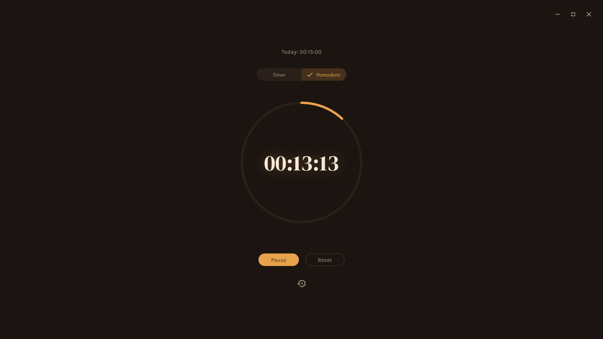

# Study Timer

A minimal, aesthetic study timer built with Flutter — inspired by the "study with me" timer videos on social media. Features a stopwatch, a Pomodoro mode with a live progress ring, and persistent session history, all wrapped in a warm, distraction-free fullscreen interface.



## Features

- **Stopwatch mode** — simple count-up timer for open-ended study sessions
- **Pomodoro mode** — countdown timer with adjustable duration (15–60 min) and a live circular progress ring
- **Session history** — every completed session is saved locally and persists across app restarts
- **Fullscreen, distraction-free UI** — custom borderless window with minimal window controls
- **Warm, custom-themed design** — hand-tuned color palette and typography, not default Material styling

## Built with

- [Flutter](https://flutter.dev) & Dart
- [window_manager](https://pub.dev/packages/window_manager) — custom frameless/fullscreen window
- [google_fonts](https://pub.dev/packages/google_fonts) — typography
- [shared_preferences](https://pub.dev/packages/shared_preferences) — local session persistence

## Getting started

1. Clone the repo:
```bash
   git clone https://github.com/MK2105-create/study_timer.git
   cd study_timer
```

2. Get dependencies:
```bash
   flutter pub get
```

3. Run on Windows:
```bash
   flutter run -d windows
```

## Notes

This was my first real Flutter project, built from scratch to learn state management, async storage, and custom UI rendering (the progress ring is hand-drawn with `CustomPainter`, not a pre-built widget). Along the way I also had to debug a handful of real environment issues — duplicate project folders, orphaned build processes locking files, and getting Windows Developer Mode + network mirrors configured correctly for building in China.Replace default README with project documentation
